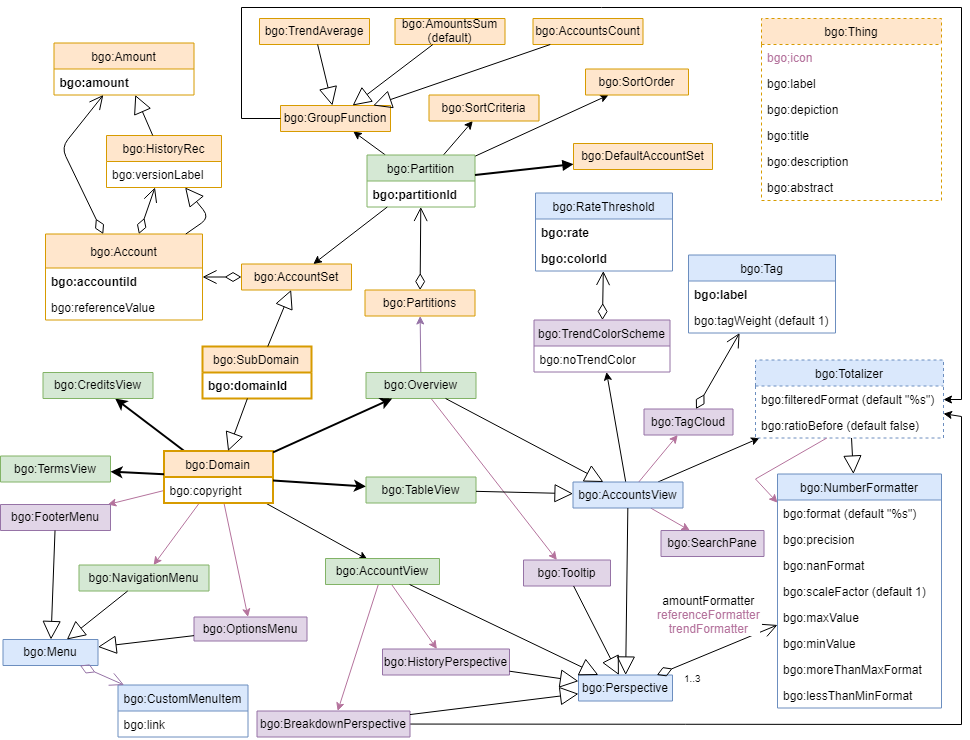

Bubble Graph Ontology (BGO)
==========================

The Bubble Graph Ontology (BGO) is a Semantic Web Application for exploring data partitions in a data-driven document.

BGO is NOT related to the meaning of the data, it's about the presentation layer.

For a live example of web resource that uses BGO, have a look to https://budget.g0v.it/

The namespace for BGO vocabulary is *http://linkeddata.center/lodmap-bgo/v1#* and the suggested prefix for the BGO namespace is **bgo** .

BGO contains three core concepts:

- the **Domain**, that describes a data driven document that contains quantitative facts that share the same meaning. There is only one Domain per ontology, a *domain* can be used to describe a Financial Report, the presence of politicians on TV or any other document that contains comparable facts.
- the **Account**, that is an a-dimensional quantity (amount) with an optional reference value. An *account* can be used to describe a fact in a Financial Report, a politician speaking time on TV or any other versionable quantitative value. An Account exposes an *accountId* that must be unique in the ontology.
- the **Partition**, that represents a partition of the all Accounts in a Domain into some disjoined subsets. There are no hierarchies between partitions, but there is always an  **Overview** that represents a partition containing just one subset with all the Accounts of a Domain.




Legenda:
- the green boxes represent the concepts related to URL addressable data-driven document sections;
- the blue boxes represent concepts related to user interactions;
- the orange boxes represent data related concepts;
- the relations and strings in bold have cardinality "exactly 1", otherwise "max 1" expected (i.e 0 or one)
- if a default is not specified, it is implementation dependent.
- the purple represents optional components (i.e. that should be not displayed if not explicitly defined in data).

All accounts in a *Domain* can be presented in a paged document (**TableView**) or as a whole in a big picture (**Overview**).

The overview admits a named list of *partitions* . 
A **Partition** is a collection of disjoined **AccountSet**s organized with some criteria. 
A partition always contains (implicitly or explicitly) a **DefaultAccountSet** that identifies all accounts 
in the domain that are not explicitly defined in the  partition. An Partition exposes a *partitionId* that must be unique in the ontology.

Overview also links some user interface concepts:

- the **SearchPane** that exposes a search expression to filter the domain amounts in some way (application dependent)
- the **TagCloud** that exposes a set of weighted tags an produce a search expression to feed the search pane (application dependent)
- the **TrendColorScheme** that exposes a color map to be used to highlight some account's aspect (application dependent)

*Accounts* information can be displayed in a **Tooltip** or in a **AccountView**. The AccountView exposes some **perspectives** that  highlight specific aspects on an Account like metadata, historical trends, breakdowns, and social impacts.

Besides these, BGO defines some other general concepts useful to a reasoner display numbers:

- the **NumberFormatter** that exposes templates and properties to display a generic number.
- the **Totalizer** that exposes some templates and properties to display a number related with another one ( usually a ratio with another value)

See above for more information about number management.

Semantic relationships are crucial to the definition of concepts. However, next to these structured characterizations, concepts have to be further defined using human-readable ("informal") documentation. Any BGO concept (**Things**) can be annotated using a set of properties derived from well-known vocabularies like Dublin Core, Foaf and RDFS:

- **icon**:  a sub-property of foaf:thumbnail.
- **depiction** : a sub-property of foaf:depiction;
- **label**: a sub-property of rdfs:label;
- **title**, **description**, **abstract** : as sub-properties of homonymous Dublin Core terms;

A BGO reasoner can use these properties to build user interface components, providing defaults if needed and taking into account the following conventions:

- *icon* is a symbol for a *label*, that in turn can be considered as a *short* of the *title*;
- the **depiction* is an image for *description*, that is expanded in the *abstract*; the abstract can contain links and references to other documents.
- an object id (e.g. partitionId) can be used as a *label* if such element and *title* are missing.


Besides classes and properties, BGO defines the some extensions to the default xsd:String datatype:
 
- **MDString** a strings that should be displayed according [Markdown](https://commonmark.org/) rendering specifications.
- **RGB** a strings that represents a RGB color matching the following regexp: *^#[0-9a-f]{6}$* (e.g. `#b2182b`)
- **Route** a strings that represents an internal routing. The expected behavior is application dependent.
- **Template** is a sprintf compatible template. At minimum a bgo reasoner should be able  just to manage the substitution of *%s*.

It also defines some subclasses for describing grouping functions in partitions: amount sum (default), accounts count, trend average; and 
some individuals for sort ordering (ascending/descending) and sort criteria (abs/natural)

BGO is expressed in a [owl file](bgo.rdf) serialized as RDF xml. You can edit the file by hand or using [Protégé](https://protege.stanford.edu/)

An html rendering of the vocabulary is provided by the [lode parser](https://w3id.org/lode/http://linkeddata.center/lodmap-bgo/v1) 


For some examples of BGO ontologies, have a look at the example directory.

BGO ontology is used by [LODMAP2D application](https://github.com/linkeddatacenter/LODMAP2D) and by some public and private projects. 

## Semantic of numbers

In BGO all quantities are a-dimensionals, so the unit of measure is something that must be managed by the ontology reasoner.

BGO defines two concepts (**NumberFormatter** and **Totalizer**) to provide the information needed by a reasoner
to display a number in a pleasant format.


### bgo:NumberFormatter reasoner requirements

NumberFormatter exposes following functional properties:

- **bgo:format**: a string or a bgo:template to be used (default= "%s"^^bgo:template ).
- **bgo:scaleFactor**: a multiplier to apply to the number (default = 1)
- **bgo:precision**: the number of decimals allowed (round applies) 
- **bgo:maxValue**:  the max value allowed for the number (after scaling)
- **bgo:minValue**:  the minimum value allowed for the number (after scaling)
- **bgo:lessThanMinFormat**: is an alternative format to be used if the number is less than minValue
- **bgo:moreThanManFormat**: is an alternative format to be used if the number is greater than maxValue
- **bgo:nanFormat**: is an alternative format to be used if the number is not defined, the default is the empty string


In following pseudo-code:

- *store* contains all information
- *formatter* is the object in datamodel of type bgo:NumberFormatter
- *x* is the number to be formatted
- *forceFormat* is an optional format that overrides the formatter one

```
function numberFormatter (store, formatter, x, forceFormat=null ) {
    IF x is a number   
    	  # here some reasonable defaults for missing properties
        scaleFactor = store.getAny(formatter,bgo:scaleFactor) || 1
        precision = store.getAny(formatter,bgo:precision) || 2
        maxValue = store.getAny(formatter,bgo:maxValue) || Infinity
        minValue = store.getAny(formatter,bgo:minValue) || -Infinity
        
        # apply some transformations to x
        x = x * scaleFactor;
        x = round ( x, precision);
        
        IF x < minValue 
            format= store.getAny(formatter,bgo:lessThanMinFormat) || "< $minValue"
        ELSEIF x > maxValue 
            format= store.getAny(formatter,bgo:moreThanMaxFormat) || "> $maxValue"
        ELSE
            format= forceFormat || store.getAny(formatter,bgo:format) || "%s"
        ENDIF
    ELSE
        format = store.getAny(formatter,bgo:nanFormat) || ""
    ENDIF

    return sprintf( format, x )
}
```

### bgo:Totalizer reasoner requirements


A Totalizer is a bidimensional vector of numbers that is normally used to represent a subtotal and an optional ratio respect to a grand total; 
This meaning is not mandatory, it can be used to ddescribe how to display two number related in some way.
It extends the NumberFormatter with following functional properties:

- **bgo:filteredFormat**: bgo:template to be used when the number is a portion of a bigger total
- **bgo:ratioFormatter**: a bgo:NumberFormatter individual to be used to format the ratio
- **bgo:ratioBefore**: a boolean (default false) that states the print order is ratio then the number.; if true vice-versa


In following pseudo-code:

- *store* contains all information
- *formatter* is the object in datamodel of type bgo:Totalizer
- *x* is the number to be formatted
- *ratio* is an optional number that represent the ratio between  x and a total (i.e. ratio = x/total )

The pseudo code depends from the numberFormatter functions previously defined:


```
function totalizer (store, formatter, x, ratio) {
    ratioFormatter = store.getAny(formatter,bgo:ratioFormatter)

    IF NOT ratio is a number OR NOT ratioFormatter
        result = numberFormatter(store, formatter, x)
    ELSE
        filteredFormat = store.getAny(formatter,bgo:filteredFormat) || "%s"
        
        xString = numberFormatter( store, formatter, x,  filteredFormat )
        ratioString = numberFormatter( store, ratioFormatter, ratio)
        
        IF store.getAny(formatter,bgo:ratioBefore)
        	result = ratioString+xString
        ELSE
        	result = xString+ratioString
        ENDIF
    ENDIF
    
    return result
}
```

## Sub domains

IN BGO a Domain class describes the totality of the accounts in the ontology. The **SubDomain** class allows to limit the number of accounts.
A SubDomain must expose an unique domainId in the ontology.

## License

The BGO ontology is available under the Creative Commons Attribution 4.0 Unported license; see http://creativecommons.org/licenses/by/4.0/. 
In a nutshell, you are free to copy, distribute and transmit the work; to remix/adapt the work (e.g. to import the ontology and create specializations of its elements),
as long as you attribute the work in the manner specified by the author or licensor 
(but not in any way that suggests that they endorse you or your use of the work).

Proper Attribution: include the statement "This work is based on the Bubble Graph Ontology (BGO), developed by Enrico Fagnoni for LinkedData.Center" and add a link to http://linkeddata.center/
